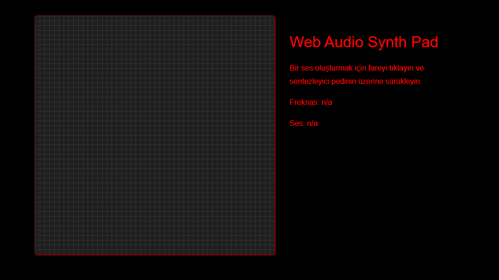

# Web-Audio-Synth
My application that can be adjusted according to the frequency of the sound and shows the speed of the sound
#
## Oroperties
- You can hear the frequency sound
- You can see the frequency speed
- You can see the speed of sound
- Ease of Use
- Visual beauty graphic
## Look out!
If you adjust the sound too much in the javascript document, you could damage your ear and speaker.
#

#

## Github Account Link

[Github account link](https://github.com/oguzhan18)

## Mail
oguzhancart1@gmail.com

# Instagram Account Link
[Instagram account](https://www.instagram.com/oguzhan_cart/)

#

